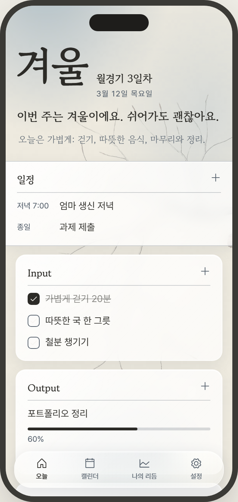
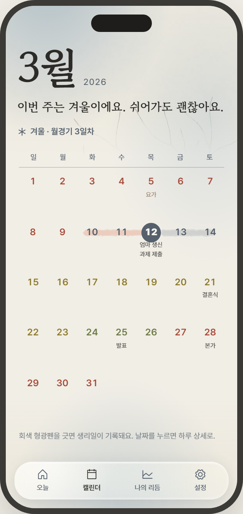
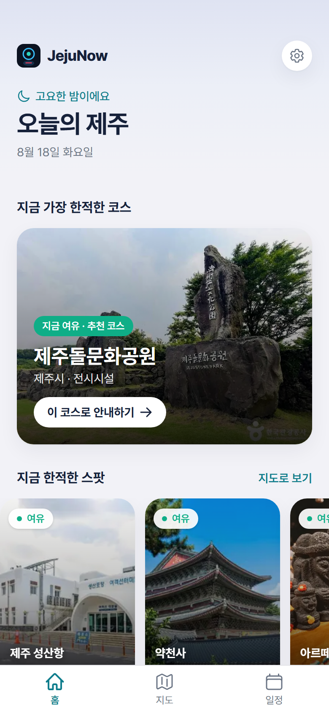
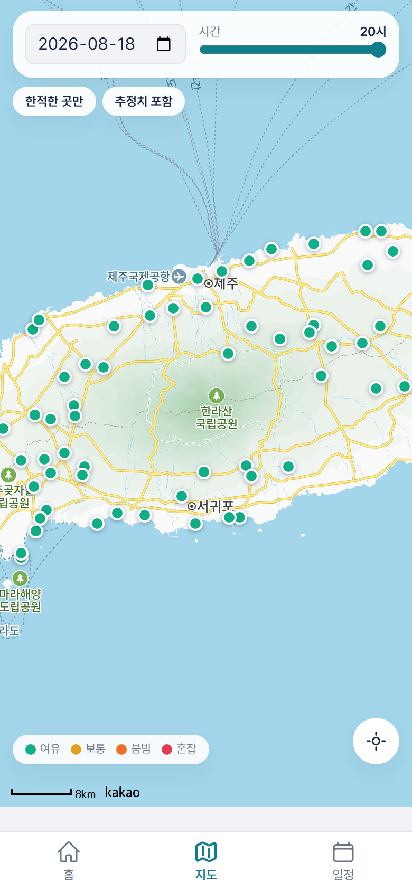

# 안녕하세요, 한예원입니다

이화여자대학교 데이터사이언스 전공 학부생. 아이디어를 앱과 서비스로 직접 만들어 배포하면서 배워가고 있습니다.

## 대표 프로젝트

| 프로젝트 | 소개 | 기술 |
|---|---|---|
| [TempoRoutine](https://github.com/Yewon419/TempoRoutine) | 무리하지 않는 리듬 기반 iOS 루틴·플래너 앱. TestFlight 베타 운영 중 | SwiftUI, SwiftData, CloudKit, WidgetKit |
| [JejuNow](https://github.com/Yewon419/JejuNow) | 제주 관광지 혼잡도 예측·여행 플래너 (웹 + iOS 앱) | Next.js, Supabase, ML, Capacitor |
| [AutoStock](https://github.com/Yewon419/AutoStock) | AI 기반 한국 주식 자동매매 플랫폼. AI 전략 생성·백테스트·실계좌 연동 | FastAPI, Vue 3, Celery, Docker, KIS API |
| [MCP_supporter](https://github.com/Yewon419/MCP_supporter) | 채팅으로 MCP 서버 설치·설정을 자동화하는 메타 MCP 서버 | Python, MCP |
| [claudebar](https://github.com/Yewon419/claudebar) | Claude 사용량을 실시간 표시하는 Windows 트레이 앱 | Python, pystray |
| [HangsungDrone](https://github.com/Yewon419/HangsungDrone) | 실내 B2B 행사용 드론쇼 운영 SaaS 백엔드 | FastAPI, SQLAlchemy, Supabase |

  
  
  
  

왼쪽부터: TempoRoutine 오늘·캘린더 (디자인 프로토타입), JejuNow 홈·혼잡도 지도 (라이브 서비스)

이 밖에 [Mypersona](https://github.com/Yewon419/Mypersona)(LLM 이식 가능한 페르소나 레이어), [MANEO](https://github.com/Yewon419/MANEO)(데스크탑 펫 게임), [cafe-finder](https://github.com/Yewon419/cafe-finder)(카페 탐색 모바일 앱) 등을 만들고 있습니다.

## 기술 스택

- **언어**: Python, TypeScript, Swift
- **백엔드**: FastAPI, SQLAlchemy, PostgreSQL, Supabase, Celery, Docker
- **프론트·앱**: Next.js, Vue 3, SwiftUI, Expo(React Native), Capacitor
- **품질·배포**: mypy strict, ruff, GitHub Actions CI, TestFlight
